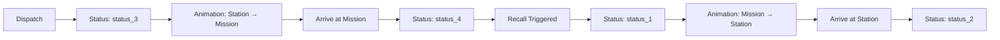

# Vehicle Routing & Animation System

**Comprehensive real-time vehicle movement system for Emergency Dispatch Game**

## Overview

The Vehicle Routing System provides realistic, animated vehicle movements between stations and mission locations using real road networks. Vehicles follow actual street routes at emergency service speeds with smooth animations and real-time status synchronization.

## System Architecture

### Core Components

```
GameLayout.tsx (Status Management)
    ↓
Map.tsx (Prop forwarding)
    ↓
LeafletMap.tsx (Animation initialization)
    ↓
vehicle-animation.ts (Animation engine)
    ↓
routing.ts (OSRM integration)
```

### Key Files

- **`src/lib/vehicle-animation.ts`** - Core animation engine with distance-based movement
- **`src/lib/routing.ts`** - OSRM integration and road distance calculation
- **`src/components/GameLayout.tsx`** - Vehicle status management and callbacks
- **`src/components/LeafletMap.tsx`** - Map integration and animation initialization

## Animation System

### Technical Specifications

- **Speed**: 70 km/h (realistic emergency vehicle speed)
- **Animation Method**: Distance-based interpolation along route geometry
- **Update Frequency**: 60 FPS via `requestAnimationFrame`
- **Route Source**: OSRM (Open Source Routing Machine) with polyline geometry

### Animation Lifecycle



### Distance-Based Animation Logic

```typescript
// Calculate position based on distance traveled along route
const targetDistance = progress * totalDistance
let accumulatedDistance = 0

for (let i = 0; i < route.length - 1; i++) {
  const segmentDistance = calculateDistanceBetweenPoints(route[i], route[i + 1])
  
  if (accumulatedDistance + segmentDistance >= targetDistance) {
    // Interpolate within this segment for smooth movement
    const segmentProgress = (targetDistance - accumulatedDistance) / segmentDistance
    // ...smooth interpolation
  }
}
```

**Benefits:**
- Consistent speed across all route segments
- No speed fluctuations at route points
- Smooth visual movement experience

## OSRM Integration

### Route Calculation

```typescript
export async function calculateRoadDistance(
  fromLat: number, fromLng: number, 
  toLat: number, toLng: number,
  includeGeometry: boolean = false
): Promise<RouteResult>
```

**Features:**
- Real road network routing
- Polyline geometry for animations
- Fallback to estimated distances (air × 1.4)
- Batch processing with rate limiting

### Polyline Parsing

Custom implementation of Google's polyline algorithm for OSRM geometry:

```typescript
function parsePolyline(encoded: string): [number, number][]
```

Converts compressed polyline strings into coordinate arrays for animation.

## Mission Location Generation

### Enhanced Location System

**Multi-layered verification:**
1. **OpenStreetMap Nominatim** - Find addresses with house numbers
2. **Water Body Detection** - Exclude lakes, rivers, reservoirs via Overpass API
3. **Road Accessibility** - Verify OSRM can route to location from user stations
4. **Address Validation** - Require specific house numbers (no field locations)

### Generation Algorithm

```typescript
// Primary: Find addresses with house numbers
const addressesWithHouseNumbers = validLocations.filter(loc => 
  loc.address?.house_number && 
  loc.address?.road && 
  (loc.address?.city || loc.address?.town)
)

// Verify road accessibility
for (const location of addressesWithHouseNumbers) {
  const isAccessible = await verifyLocationAccessible(lat, lng)
  if (isAccessible) return location
}
```

**Fallback System:**
1. Try 5 addresses with house numbers
2. For special facilities: hospitals, schools (without house numbers)
3. Expanded radius search for real addresses
4. Last resort: Random coordinates (with warning)

## Real-time Status Management

### FMS Status Integration

**German Emergency Service Status Codes:**
- `status_1` - Einsatzbereit über Funk (triggering return journey)
- `status_2` - Einsatzbereit auf Wache (at station)
- `status_3` - Anfahrt zum Einsatzort (en route to mission)
- `status_4` - Am Einsatzort (on scene)

### Status Transition Triggers

```typescript
// Dispatch: status_2 → status_3
if (oldVehicle.status === 'status_2' && newVehicle.status === 'status_3') {
  // Start animation to mission
  await vehicleAnimationRef.current.addVehicleAnimation(
    vehicleWithType, stationPos, [mission.lat, mission.lng], 'to_mission'
  )
}

// Recall: status_4 → status_1  
if (oldVehicle.status === 'status_4' && newVehicle.status === 'status_1') {
  // Start return animation to station
  await vehicleAnimationRef.current.addVehicleAnimation(
    vehicleWithType, [mission.lat, mission.lng], stationPos, 'to_station'
  )
}
```

### Vehicle Arrival Handling

```typescript
const handleVehicleArrival = async (vehicleId: number, journeyType: 'to_mission' | 'to_station') => {
  if (journeyType === 'to_mission') {
    // Vehicle arrived at mission
    await updateVehicleStatus(vehicleId, 'status_4')
    await updateMissionStatus(missionId, 'on_scene')
  } else {
    // Vehicle returned to station  
    await updateVehicleStatus(vehicleId, 'status_2')
    await removeVehicleFromMission(vehicleId, missionId)
  }
}
```

## Performance Optimizations

### Animation Performance
- **Single animation loop** for all vehicles
- **Automatic cleanup** when no vehicles animating
- **Efficient distance calculations** with caching
- **Smooth interpolation** without frame drops

### API Rate Limiting
- **Batch OSRM requests** (5 vehicles at once)
- **100ms delays** between batches
- **Fallback calculations** for failed requests
- **Smart caching** for repeated routes

### Memory Management
- **Automatic marker removal** on animation completion
- **Layer group cleanup** on component unmount
- **Animation frame cancellation** when not needed

## User Experience Features

### Visual Feedback
- **Immediate marker appearance** on dispatch
- **Smooth route-following animation** 
- **Marker disappearance** at destination
- **Real-time status updates** in mission panel

### Mission Panel Integration
- **Live vehicle status display** with German FMS codes
- **Automatic updates** when vehicles arrive/depart
- **Mission status synchronization** (new ↔ dispatched ↔ on_scene)
- **Individual vehicle recall** buttons with animations

## Error Handling & Fallbacks

### OSRM Failure Handling
```typescript
if (!routeResult.success || !routeResult.geometry) {
  console.warn(`Route calculation failed, using direct path`)
  // Fallback to straight line animation
  routeResult.geometry = [
    [startPos[1], startPos[0]], // [lng, lat] format
    [endPos[1], endPos[0]]
  ]
}
```

### Location Generation Fallbacks
1. **OSRM routing fails** → Estimated road distance (air × 1.4)
2. **No house numbers found** → Expanded search radius
3. **API failures** → Cached/random coordinates with warnings
4. **Water body detection fails** → Conservative rejection

### Database Coordinate Loading
**Critical Fix Applied (September 2025):**
```typescript
// loadDispatchedVehicles must include station coordinates
const { data: vehicles, error } = await supabase
  .from('vehicles')
  .select(`
    *,
    vehicle_types (name, required_station_type),
    stations!inner (
      name,
      station_blueprints (
        city,
        lat,  // ← Required for recall animations
        lng   // ← Required for recall animations
      )
    )
  `)
```

**Issue Fixed:** OSRM API error 400 with undefined coordinates during recall animations. The `loadDispatchedVehicles` function was missing `lat` and `lng` selection from `station_blueprints`, causing `toLat` and `toLng` to be undefined in recall operations.

## Configuration

### Speed Settings
```typescript
// In vehicle-animation.ts
const estimatedJourneyTimeMs = (totalDistance / 70) * 60 * 60 * 1000 // 70 km/h
```

### Animation Settings
```typescript
// Update frequency
updateAnimations() // Called via requestAnimationFrame (60 FPS)

// Immediate marker removal at destination
vehiclesToRemove.push(vehicleId) // Immediate removal at both mission and station
// No delays - vehicles disappear immediately upon arrival at any destination
```

### Mission Generation Settings
```typescript
// Location search parameters
const radiusKm = 5 // Initial search radius
const maxAttempts = 10 // Fallback attempts
const maxDistance = 50 // Maximum route distance in km
```

## Debugging & Logging

### Console Output
- `"Starting animation: [callsign] to mission at [coordinates]"`
- `"Vehicle [callsign] arrived at mission, setting status to status_4"`  
- `"Found accessible mission location: [address]"`
- `"Vehicle [callsign] disappeared at mission location"`

### Performance Monitoring
- Route calculation success/failure rates
- Animation frame performance
- API response times and error rates
- Memory usage for marker management

## Future Enhancements

### Potential Improvements
- **Multi-route optimization** for multiple vehicles
- **Traffic-aware routing** with real-time data
- **Vehicle-specific speeds** based on vehicle type
- **Route caching** for frequently used paths
- **Advanced pathfinding** for complex scenarios

### Integration Points  
- **Mission completion system** - trigger animations for task completion
- **Economic system** - fuel costs based on actual distances traveled
- **Multiplayer coordination** - synchronized vehicle movements
- **Advanced AI dispatch** - optimal vehicle assignment with routing

---

**System Status: Fully Operational ✅**
- All core features implemented and tested
- Real-time animations working smoothly
- Mission integration complete
- Performance optimized for production use

**Latest Updates (September 2025):**
- ✅ Automatic vehicle dispatch on mission assignment (no test button required)
- ✅ Real-time mission status subscriptions for live UI updates
- ✅ Vehicles automatically transition: status_3 (en route) → status_4 (on scene) on arrival
- ✅ Vehicle recall works without page reload with immediate UI feedback
- ✅ Mission panel updates automatically when vehicles arrive or are recalled
- ✅ Complete end-to-end automation: dispatch → animate → arrive → update status → recall → animate → return